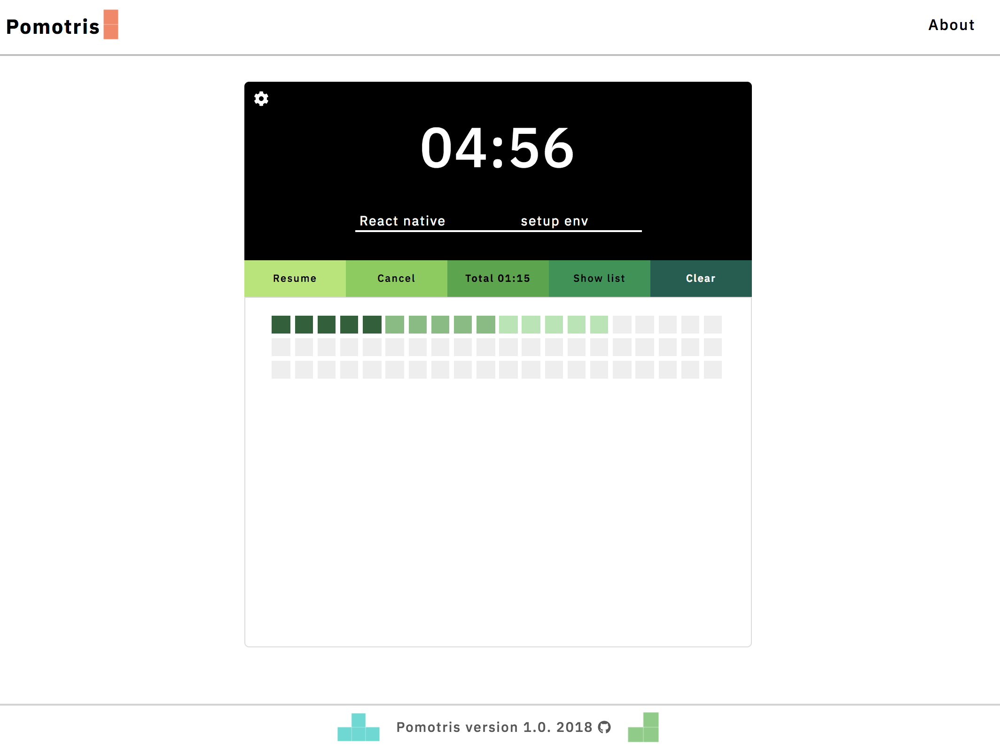
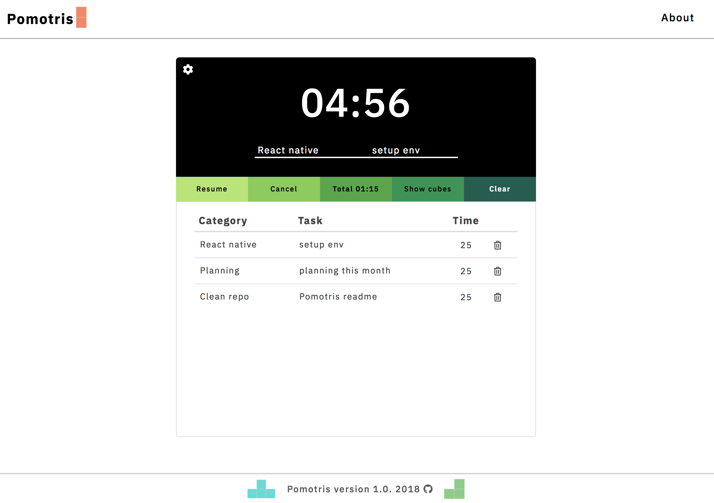
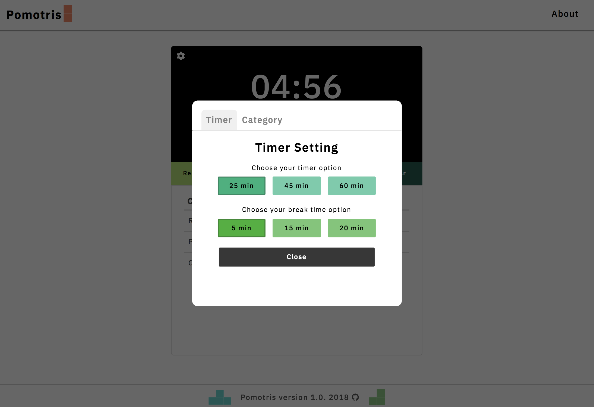
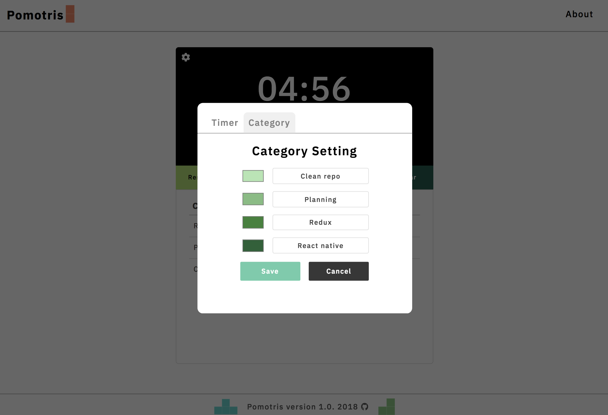

# Pomortris

### Description:page_facing_up:

Pomotris is a pomodoro timer web application with a cube chart which visualizes records with colorful cubes.  
Each cube represents 5 mins. Have fun collecting colorful cubes by being productive.

Your Records will be save inside localStorage of your browser to help the data persistance.  
Application is restored each day and data gets cleared up at 00:00 everyday.  
Click [here](https://pomotris.surge.sh)

### Product

### User Journey

* Click setting, user can select timer setting and set a name for 4 different categories and a color for each category.
* Click `Start` or `Stop` to manage timer clock.
* User can see total time in the middle of app.
* Click `Show cubes` or `Show list` to toggle display mode between cubes and lists.
* When user sees list of records, user can click trash icon to remove individual record.
* Click `Clear` to remove entire timer records.

---
